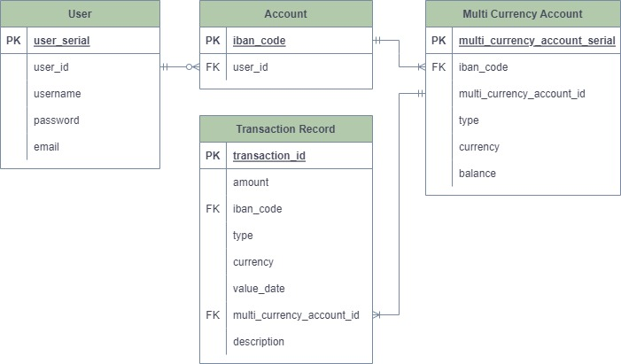
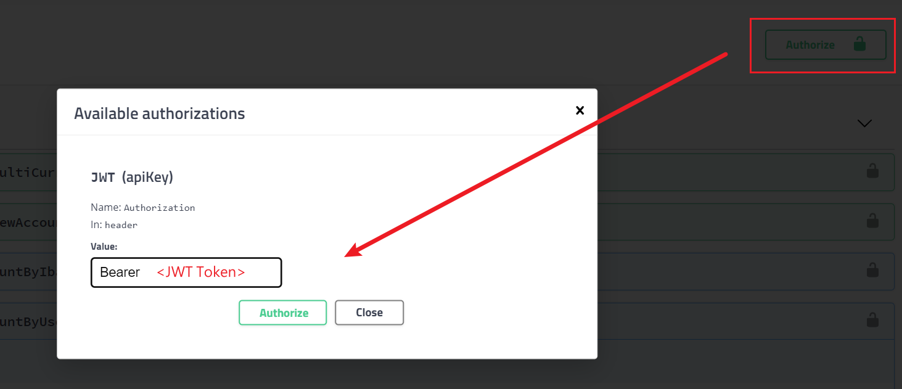
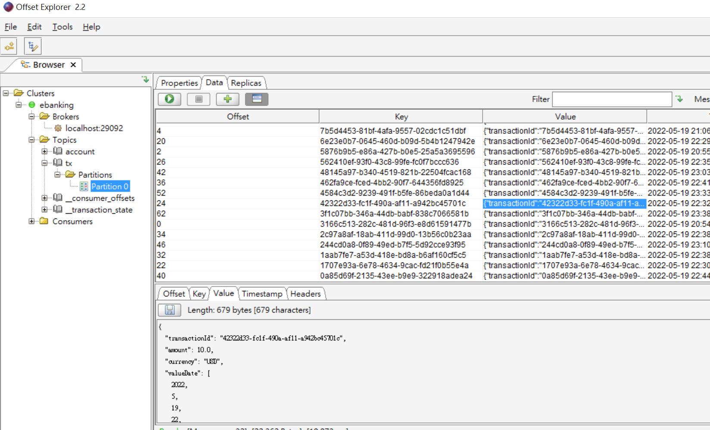

# Challenge of Ebanking Backend

> Not familiar with k8s and CI/CD, still learning how to use them.

## DB Entity Relationship

## Start
1. Start the container:
`docker-compose up --build`
2. Open `http://localhost:8080/swagger-ui.html`
3. **Register** a new user
4. Create a new account
5. Authorize

6. (optional) Create multi currency account 
7. Create transaction

## APIs

### Authentication
POST `/api/auth/register`
Create a new user

POST `/api/auth/login`
When the jwt token expired, refresh it

GET `/api/auth/user`
Get current username

### Account
POST `/api/account/createNewAccount`
A user can own many accounts

POST `/api/account/createMultiCurrencyAccount`
A account may have multiple sub accounts (with different currency and type).

GET `/api/account/getAccountByIbanCode`
Return account set (may contain many sub accounts) by iban-code.

GET `/api/account/getAccountByUser`
Return all accounts which user owns.

### Transaction
POST `/api/transaction/createTransactionRecord`
Create transactions record, and send to kafka.

GET `/api/transaction/getTransactions`
Return transaction by month.

## Kafka
Only have one zookeeper and one broker.
When the transactions finished, can find in UI tool (Offset Explorer)

